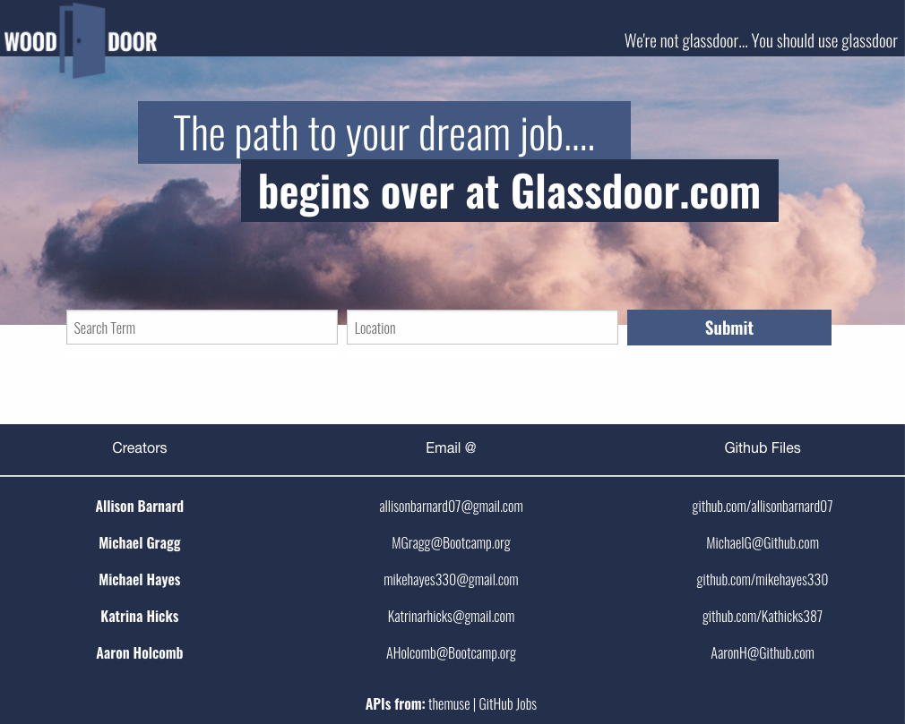
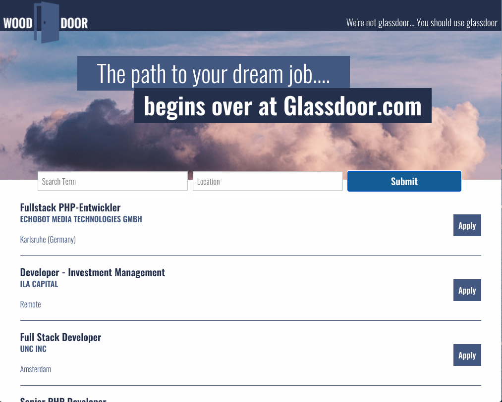
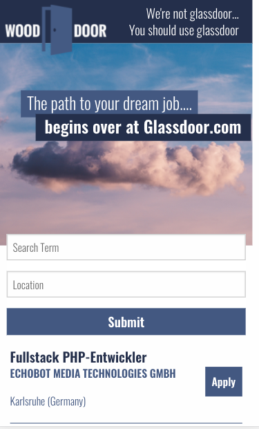

# Job-Search
As a recent graduate of a coding bootcamp, users will need an app that will successfully help them to gain employment.
 
Users are able to enter desired job they are looking for and location into our search. They will be presented with matching jobs in a list. Users are able to click the apply button to apply for any of the listed jobs - this will take them directly to the site to apply. Jobs on the site were pulled from Muse and GitHub Jobs APIs.
 
Github link: https://github.com/Kathicks387/Job-Search
 
Site link: https://kathicks387.github.io/Job-Search/
 
Preview: 
 
Preview: 
 
Preview: 
